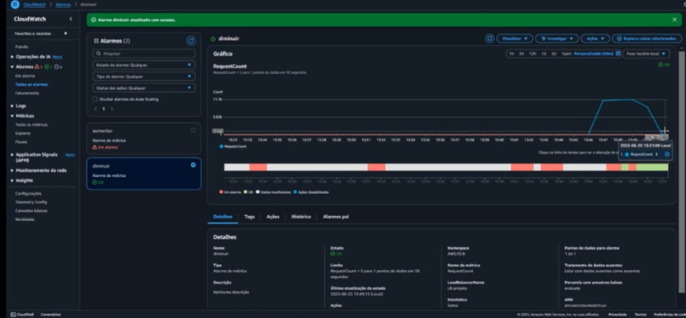

# Projeto AWS - Escalonamento Automático com CLB e ASG

## Visão Geral

Este projeto tem como objetivo a construção de uma infraestrutura escalável e automatizada na AWS, utilizando os serviços **Auto Scaling Group (ASG)**, **Classic Load Balancer (CLB)** e **CloudWatch**, com um endpoint HTTP simples para simulação de carga. Desenvolvido como atividade prática durante o estágio em DevSecOps.

---

## Pré-requisitos

* Conta ativa na AWS
* Permissões para criação de VPCs, EC2, Load Balancers, Auto Scaling e CloudWatch
* Conhecimentos básicos em redes, instâncias EC2 e scripts de inicialização
* Acesso via terminal ou console da AWS

---

## Arquitetura da Solução

O projeto foi dividido em seis etapas principais:

1. **Criação da VPC**
2. **Configuração dos Security Groups**
3. **Criação do Modelo de Execução (Launch Template)**
4. **Criação do Classic Load Balancer (CLB)**
5. **Configuração do Auto Scaling Group (ASG)**
6. **Criação de Alarmes no CloudWatch**

As instâncias respondem a requisições no endpoint `/teste`, que simula uma carga de processamento. A métrica de requisições por instância é utilizada para escalonar automaticamente a infraestrutura.

---

## Estrutura do Repositório

```
├── README.md              ← Este documento
├── user-data.sh           ← Script de inicialização da instância
└── imagens/               ← Capturas de tela das etapas do projeto
```

---

## Etapas do Projeto

### 1. Criação da VPC

* Foi criada uma VPC customizada com subnets públicas.
* Configuração de tabela de rotas, gateway de internet e associações.
* As instâncias, o load balancer e o ASG foram configurados dentro dessa VPC.

<p align="center"></p>
<p align="center"></p>
<p align="center"></p>
<p align="center"></p>
---

### 2. Configuração dos Security Groups

* **Instâncias EC2**: portas 22 (SSH) e 80 (HTTP) liberadas.
* **Load Balancer**: porta 80 liberada para entrada pública.
* Os Security Groups foram associados às respectivas funções no projeto.

<p align="center"></p>
<p align="center"></p>
<p align="center"></p>
<p align="center"></p>
<p align="center"></p>
---

### 3. Criação do Modelo de Execução (Launch Template)

* Utilizado para padronizar as instâncias EC2 lançadas pelo Auto Scaling.
* Baseado na AMI Amazon Linux 2.
* Inclui script de inicialização (`user-data`) responsável por configurar o servidor Apache e o endpoint `/teste`.

#### Script Utilizado

```bash
#!/bin/bash
yum update -y
yum install -y httpd
echo "Hello World" > /var/www/html/index.html

cat <<EOL > /var/www/html/teste
#!/bin/bash
echo "Content-type: text/plain"
echo ""
echo "Requisição recebida em $(hostname)"
sleep 5
EOL

chmod +x /var/www/html/teste
systemctl start httpd
systemctl enable httpd
```

<p align="center"></p>
<p align="center"></p>
<p align="center"></p>
<p align="center"></p>
<p align="center"></p>

---

### 4. Criação do Classic Load Balancer (CLB)

* Criado dentro da mesma VPC e subnets configuradas.
* Listener configurado na porta HTTP (80).
* Conectado ao Auto Scaling Group para registrar instâncias automaticamente.

<p align="center"></p>
<p align="center"></p>
<p align="center"></p>
<p align="center"></p>

---

### 5. Configuração do Auto Scaling Group (ASG)

* Utiliza o modelo de execução criado anteriormente.
* Limites configurados:

  * Mínimo: 1 instância
  * Máximo: 3 instâncias
* O ASG está vinculado ao Load Balancer para distribuir o tráfego.

<p align="center"></p>
<p align="center"></p>
<p align="center"></p>
<p align="center"></p>
<p align="center"></p>

---

### 6. Criação de Alarmes no CloudWatch

* Foram criados dois alarmes baseados na métrica `RequestCountPerTarget`.

**Escalonamento para cima**

* Condição: mais de 10 requisições por instância
* Ação: adicionar 1 instância

**Escalonamento para baixo**

* Condição: menos de 5 requisições por instância
* Ação: remover 1 instância

<p align="center"></p>
<p align="center"></p>
<p align="center"></p>
<p align="center"></p>
<p align="center"></p>
<p align="center"></p>
<p align="center"></p>
<p align="center"></p>

**Métricas:**

<p align="center"></p>
<p align="center"></p>
<p align="center"></p>
---

## Teste de Carga com Apache Benchmark (ab)

Para simular múltiplas requisições simultâneas e disparar os alarmes de escalonamento, foi utilizado o seguinte comando:

```bash
ab -t 300 -c 50 http://LB-projeto-793430503.us-east-1.elb.amazonaws.com/teste
```

* `-t 300`: duração do teste (5 minutos)
* `-c 50`: 50 requisições concorrentes
* O script no endpoint `/teste` contém um `sleep 5` para simular tempo de resposta e carga

Durante a execução, foi possível observar o aumento automático do número de instâncias no ASG.

*Inserir print do terminal com a execução do `ab`*
*Inserir gráfico do CloudWatch com a variação das instâncias*

<p align="center"></p>
<p align="center"></p>
<p align="center"></p>
<p align="center"></p>
---

## Resultado Esperado

* As requisições ao endpoint `/teste` são atendidas por diferentes instâncias EC2.
* O número de instâncias varia automaticamente de acordo com a carga.
* O ambiente responde de forma dinâmica, garantindo escalabilidade e controle de recursos.

<p align="center"></p>
---

## Documentações Referenciadas

* [Auto Scaling Group – AWS](https://docs.aws.amazon.com/autoscaling/ec2/userguide/what-is-amazon-ec2-auto-scaling.html)
* [Classic Load Balancer – AWS](https://docs.aws.amazon.com/elasticloadbalancing/latest/classic/introduction.html)
* [CloudWatch Alarms – AWS](https://docs.aws.amazon.com/AmazonCloudWatch/latest/monitoring/AlarmThatSendsEmail.html)
* [Apache Benchmark (ab)](https://httpd.apache.org/docs/2.4/programs/ab.html)

---

## Desenvolvedores

Este projeto foi desenvolvido como parte do estágio em DevSecOps por:

* Giovanna Freitas
* Lucas Abraão